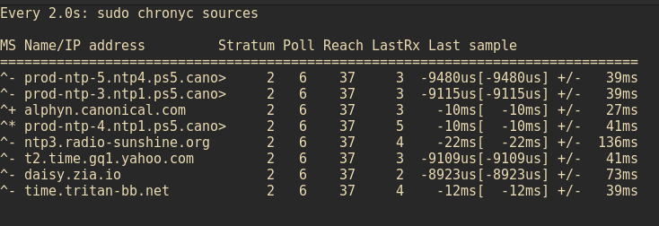
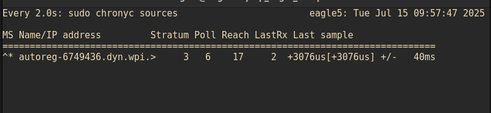

# ACP Eagle Platform

The following commands should be executed on the **robot computer (Jetson Orin NX)**, which must have **JetPack 6.2 flashed onto the device**.

For detailed instructions on this procedure, please refer to the following repository:

[acp-hardware-platforms](https://github.com/acp-lab/acp-hardware-platforms.git)

Switch to the branch `guanrui/jetpack6.2_seeedstudio` — it contains a detailed explanation of how to set up the platform and flash JetPack 6.2.


### Install Dependencies on the Robot

On the **Jetson Orin NX**, run the following commands to install the required dependencies:
```bash
sudo apt-key adv --keyserver keyserver.ubuntu.com --recv-keys A5D32F012649A5A9
sudo apt-get update && sudo apt-get install -y     build-essential     libssl-dev     uuid-dev     libgpgme11-dev     squashfs-tools     libseccomp-dev     pkg-config
sudo wget -O- http://neuro.debian.net/lists/xenial.us-ca.full | sudo tee /etc/apt/sources.list.d/neurodebian.sources.list &&     sudo apt-key adv --recv-keys --keyserver hkp://pool.sks-keyservers.net:80 0xA5D32F012649A5A9 &&     sudo apt-get update
```
The workspace uses Singularity; therefore, we need to install Singularity and all necessary dependencies associated with it.
We can install Go with the following commands:
```bash
clear
export GOVERSION=1.21.6
export ARCH=arm64
export OS=linux
cd $HOME
wget https://go.dev/dl/go${GOVERSION}.${OS}-${ARCH}.tar.gz -O /tmp/go${GOVERSION}.${OS}-${ARCH}.tar.gz
sudo rm -rf /usr/local/go
sudo tar -C /usr/local -xzf /tmp/go${GOVERSION}.${OS}-${ARCH}.tar.gz
echo 'export PATH=$PATH:/usr/local/go/bin' >> ~/.bashrc
source ~/.bashrc
go version
```
We can install Singularity with the following commands:
```bash
wget https://github.com/singularityware/singularity/releases/download/v3.5.3/singularity-3.5.3.tar.gz
tar -xzvf singularity-3.5.3.tar.gz
cd singularity
./mconfig
cd builddir/
make
sudo make install
sudo apt-get update
```
At this point, Singularity has been installed on our Eagle platform.
We can proceed with some additional required dependencies for the system.
Install the following packages using the command below:
```bash
sudo apt-get install -y    autoconf    automake    cryptsetup    fuse2fs    git    fuse    libfuse-dev    libglib2.0-dev    libseccomp-dev    libtool    pkg-config    runc    squashfs-tools    squashfs-tools-ng    uidmap    wget    zlib1g-dev
sudo apt install htop
```

Include the following aliases in the bashrc file
```bash
export PATH=/usr/local/go/bin:$PATH
export CUDA_HOME=/usr/local/cuda-11.8/
export PATH=/usr/local/cuda/bin${PATH:+:${PATH}}
export LD_LIBRARY_PATH=/usr/local/cuda/lib64${LD_LIBRARY_PATH:+:${LD_LIBRARY_PATH}}
```

Include the following alias in he bashrc
```bash
alias r2="source /opt/ros/humble/setup.bash"
alias r1="source /opt/ros/noetic/devel/setup.bash"
alias br2="colcon build --symlink-install"
function acp_build(){
colcon build --symlink-install --packages-select $1
}
alias fanmax="sudo jetson_clocks --fan"
alias runsin="sudo singularity exec -B /run --nv --overlay /home/$HOSTNAME/ws/overlay.ext3 /home/$HOSTNAME/ws/arm.sif /bin/bash"

# Chrony
alias chkchrony="watch -c sudo chronyc sources"
alias enable_chrony="sudo systemctl enable chrony.service"
alias restart_chrony="sudo systemctl restart chrony"
alias edit_chrony="sudo vim /etc/chrony/chrony.conf"

# openBash
alias gb="vim ~/.bashrc"
alias gi="source ~/.bashrc"
fanmax
```
## Singularity Files
After this point, we need the Singularity files. These files can be downloaded from the following link:
[Singularity](
https://wpi0-my.sharepoint.com/personal/gli7_wpi_edu/_layouts/15/onedrive.aspx?id=%2Fpersonal%2Fgli7%5Fwpi%5Fedu%2FDocuments%2FLab%20Files%2FResearch%2FACP%5Fautonomy%5Fsingularity%5Ffiles%2F2025%5F02%5F20&e=5%3Added85e5885640eeb714e54d2a7c8b1d&sharingv2=true&fromShare=true&at=9&CT=1737433616510&OR=OWA%2DNT%2DMail&CID=1b6adb1e%2D9f18%2D37e4%2D1830%2Dd2edeeb76a45&clickParams=eyJYLUFwcE5hbWUiOiJNaWNyb3NvZnQgT3V0bG9vayBXZWIgQXBwIiwiWC1BcHBWZXJzaW9uIjoiMjAyNTAxMTAwMDMuMTciLCJPUyI6IkxpbnV4IHVuZGVmaW5lZCJ9&cidOR=Client&FolderCTID=0x0120003428F273A42BA74BAAF116C7DA5A52A6&view=0
)

The three files should be located in a folder called `ws`.
The folder structure should look like this:

```
ws
├── arm.sif
├── env_setup.sh
└── overlay.ext3
```

Finally, we can run the Singularity container with the following command:

```bash
runsin
```

Once you are running the container, navigate to the following folder and verify that the file `env_setup.sh` is located there:

```bash
cd /ext3
```

If the file is not present, we need to manually move it and provide the necessary executable permissions. This can be done with the following commands (remember, you should already be inside the Singularity container):

```bash
cp /home/eagle5/ws/env_setup.sh /ext3/
chmod +x /ext3/env_setup.sh
source /ext3/env_setup.sh
```

After this step, we can continue to the workspace with the following command:

```bash
cd /ext3/ws_acp/
```

You should be able to see the following directory structure under the `ws_acp` folder:

```
build
install
log
src
```

### Building the workspace

Since the file `env_setup.sh` contains the following aliases:

```bash
alias r2="source /opt/ros/humble/setup.bash"
alias r1="source /opt/ros/noetic/devel/setup.bash"
alias br2="colcon build --symlink-install"
```

We can build the packages within `ws_acp` by executing the following commands:

```bash
cd /ext3/ws_acp/
r2
br2
source install/setup.bash
```

### Set up tmux inside Singularity (Optional)
This section provides information about how to setup tmux inside singularity workspace.
Copy the file located at /tmux/cusomtmux.sh by following the next commands while you are inside singularity container:
```bash
runsin
git clone git@github.com:acp-lab/acp_eagle_setup.git
git checkout jetpack_6.2
cp /home/eagle5/acp_eagle_setup/tmux/customtmux.sh /ext3/ws_acp/
```


## Chrony Setup (Eagle and Station Computer)

Install Chrony on your laptop and the robot.
If you are installing Chrony on the Eagle robot, do it **outside** the Singularity container.

```bash
sudo apt install chrony
```

### Robot

Clone the following repository and switch to the respective branch. Here we are using branch `jetpack_6.2`:

```bash
git clone git@github.com:acp-lab/acp_eagle_setup.git
git checkout jetpack_6.2
```

Download and replace the `chrony.conf` files from the `chrony` directory to both the laptop and the robot. On the robot, run:

```bash
sudo cp ~/acp_eagle_setup/chrony/robot/chrony.conf /etc/chrony/chrony.conf
```

Next, modify the IP address in the `chrony.conf` file.
You can do this by running:

```bash
edit_chrony
```

Then update line 26 to include the IP address of the **station computer (laptop)**:

```bash
#server "ip address of the laptop" iburst
server 130.215.11.163 iburst
```

Also update line 32 to allow connections from the network:

```bash
allow 130.215
```

Once these steps are complete, enable and restart Chrony using the following commands:

```bash
enable_chrony
restart_chrony
```

**Note:** These steps should be performed on the robot, not on the station computer (laptop).

---

### Station

Clone the repository and switch to branch `jetpack_6.2`:

```bash
git clone git@github.com:acp-lab/acp_eagle_setup.git
git checkout jetpack_6.2
```

On your laptop, run:

```bash
sudo cp ~/acp_eagle_setup/chrony/laptop/chrony.conf /etc/chrony/chrony.conf
```

Modify the IP address in `/etc/chrony/chrony.conf`.
You can edit the file with:

```bash
sudo vim /etc/chrony/chrony.conf
```

Update line 30 to replace `robot-ip-address` with the network portion of the address:

```bash
allow 130.215
```

Finally, enable and restart the service:

```bash
sudo systemctl enable chrony.service
sudo systemctl restart chrony
```

**Note:** These steps should be performed on the laptop, not on the robot.

---

### Verify Synchronization

Check the clock offset by running the following command on both the laptop and the robot:

```bash
watch -c sudo chronyc sources
```

You should see output similar to the following on the laptop:



And on the robot:



Notice that a time offset of approximately **40 ms** indicates that synchronization was successful.


## Install QGroundControl on the Station Computer

### Ubuntu Linux

QGroundControl can be installed and run on **Ubuntu 22.04 LTS (and later)**.

> **Note:**
> Ubuntu comes with a serial modem manager that can interfere with robotics-related use of serial ports (including USB serial devices).
> Before installing QGroundControl, you should remove the modem manager and grant yourself permission to access serial ports.
> Additionally, GStreamer must be installed to support video streaming.

#### Pre-installation steps

In the terminal, run the following commands:

```bash
sudo usermod -a -G dialout $USER
sudo apt-get remove modemmanager -y
sudo apt install -y \
  gstreamer1.0-plugins-bad \
  gstreamer1.0-libav \
  gstreamer1.0-gl \
  libfuse2 \
  libxcb-xinerama0 \
  libxkbcommon-x11-0 \
  libxcb-cursor-dev
```

After completing these steps, **log out and log back in** to apply the updated user permissions.

#### Install QGroundControl

Download the latest `QGroundControl` AppImage from the following link:

[Download QGroundControl-x86\_64.AppImage](https://d176tv9ibo4jno.cloudfront.net/latest/QGroundControl-x86_64.AppImage)

Once downloaded, install (and run) using the terminal:

```bash
chmod +x ./QGroundControl-x86_64.AppImage
./QGroundControl-x86_64.AppImage
```


## Setup of the Pixracer Pro flight controller

We need to download the files `mro_pixracerpro_default.px4` and `eagle4.params` from the following link:

[PX4-Files](https://wpi0-my.sharepoint.com/personal/gli7_wpi_edu/_layouts/15/onedrive.aspx?id=%2Fpersonal%2Fgli7%5Fwpi%5Fedu%2FDocuments%2FLab%20Files%2FResearch%2FPX4%5FEAGLE&e=5%3Added85e5885640eeb714e54d2a7c8b1d&sharingv2=true&fromShare=true&at=9&CT=1737433616510&OR=OWA%2DNT%2DMail&CID=1b6adb1e%2D9f18%2D37e4%2D1830%2Dd2edeeb76a45&clickParams=eyJYLUFwcE5hbWUiOiJNaWNyb3NvZnQgT3V0bG9vayBXZWIgQXBwIiwiWC1BcHBWZXJzaW9uIjoiMjAyNTAxMTAwMDMuMTciLCJPUyI6IkxpbnV4IHVuZGVmaW5lZCJ9&cidOR=Client&FolderCTID=0x0120003428F273A42BA74BAAF116C7DA5A52A6&view=0)

To set up the flight controller with the appropriate firmware, we need to upload the following file:

```
mro_pixracerpro_default.px4
```

This can be done through QGroundControl in the Firmware section.

See the following images for more details.


We can also upload predefined parameters for the flight. These parameters have been previously tuned and seem to work properly, but feel free to modify them as needed:

```
eagle4.params
```


## Modify SD
Remember to modify the SD of the pixracer pro with a file called extrax.txt located in the etc folder

```bash
sleep 20
uxrce_dds_client stop
sleep 20
uxrce_dds_client start -d  /dev/ttyS2 -b 1000000 -n eagle1
```


## Steps To fly
## How to Fly Autonomous Mode

## Update date and time
Sometimes while using chrony we can lost the date and time on the robot, this can also proudce problems realted to clonning a repository. We can solve this problem by executing the following command.
```bash
sudo apt-get install ntp
```

Remember everytime you are flying you should verify that chorny is sinchronize


## Progress Overview

- [x] Jetson Orin NX flashed with JetPack 6.2
- [x] Dependencies installed on robot
- [x] Singularity installed and configured
- [x] Workspace built (`ws_acp`)
- [x] Chrony set up and verified on robot and laptop
- [ ] Install and test QGroundControl on laptop
- [ ] Set up Pixracer Pro flight controller (upload firmware and parameters)
- [ ] Modify Pixracer Pro SD card
- [ ] Document steps to fly